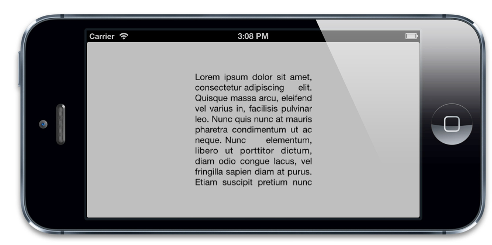

# CATextLayer


用户界面是无法从一个单独的图片里面构建的。一个设计良好的图标能够很好地表现一个按钮或控件的意图，不过你迟早都要需要一个不错的老式风格的文本标签。

如果你想在一个图层里面显示文字，完全可以借助图层代理直接将字符串使用Core Graphics写入图层的内容（这就是UILabel的精髓）。如果越过寄宿于图层的视图，直接在图层上操作，那其实相当繁琐。你要为每一个显示文字的图层创建一个能像图层代理一样工作的类，还要逻辑上判断哪个图层需要显示哪个字符串，更别提还要记录不同的字体，颜色等一系列乱七八糟的东西。

万幸的是这些都是不必要的，Core Animation提供了一个`CALayer`的子类`CATextLayer`，它以图层的形式包含了`UILabel`几乎所有的绘制特性，并且额外提供了一些新的特性。

同样，`CATextLayer`也要比`UILabel`渲染得快得多。很少有人知道在iOS 6及之前的版本，`UILabel`其实是通过WebKit来实现绘制的，这样就造成了当有很多文字的时候就会有极大的性能压力。而`CATextLayer`使用了Core text，并且渲染得非常快。

让我们来尝试用`CATextLayer`来显示一些文字。清单6.2的代码实现了这一功能，结果如图6.2所示。

清单6.2 用`CATextLayer`来实现一个`UILabel`

```objective-c
@interface ViewController ()

@property (nonatomic, weak) IBOutlet UIView *labelView;

@end

@implementation ViewController
- (void)viewDidLoad
{
  [super viewDidLoad];

  //create a text layer
  CATextLayer *textLayer = [CATextLayer layer];
  textLayer.frame = self.labelView.bounds;
  [self.labelView.layer addSublayer:textLayer];

  //set text attributes
  textLayer.foregroundColor = [UIColor blackColor].CGColor;
  textLayer.alignmentMode = kCAAlignmentJustified;
  textLayer.wrapped = YES;

  //choose a font
  UIFont *font = [UIFont systemFontOfSize:15];

  //set layer font
  CFStringRef fontName = (__bridge CFStringRef)font.fontName;
  CGFontRef fontRef = CGFontCreateWithFontName(fontName);
  textLayer.font = fontRef;
  textLayer.fontSize = font.pointSize;
  CGFontRelease(fontRef);

  //choose some text
  NSString *text = @"Lorem ipsum dolor sit amet, consectetur adipiscing \ elit. Quisque massa arcu, eleifend vel varius in, facilisis pulvinar \ leo. Nunc quis nunc at mauris pharetra condimentum ut ac neque. Nunc elementum, libero ut porttitor dictum, diam odio congue lacus, vel \ fringilla sapien diam at purus. Etiam suscipit pretium nunc sit amet \ lobortis";

  //set layer text
  textLayer.string = text;
}
@end
```



图6.2 用`CATextLayer`来显示一个纯文本标签

如果你仔细看这个文本，你会发现一个奇怪的地方：这些文本有一些像素化了。这是因为并没有以Retina的方式渲染，第二章提到了这个`contentScale`属性，用来决定图层内容应该以怎样的分辨率来渲染。`contentsScale`并不关心屏幕的拉伸因素而总是默认为1.0。如果我们想以Retina的质量来显示文字，我们就得手动地设置`CATextLayer`的`contentsScale`属性，如下：

```objective-c
textLayer.contentsScale = [UIScreen mainScreen].scale;
```

这样就解决了这个问题（如图6.3）


图6.3 设置`contentsScale`来匹配屏幕

`CATextLayer`的`font`属性不是一个`UIFont`类型，而是一个`CFTypeRef`类型。这样可以根据你的具体需要来决定字体属性应该是用`CGFontRef`类型还是`CTFontRef`类型（Core Text字体）。同时字体大小也是用`fontSize`属性单独设置的，因为`CTFontRef`和`CGFontRef`并不像UIFont一样包含点大小。这个例子会告诉你如何将`UIFont`转换成`CGFontRef`。

另外，`CATextLayer`的`string`属性并不是你想象的`NSString`类型，而是`id`类型。这样你既可以用`NSString`也可以用`NSAttributedString`来指定文本了（注意，`NSAttributedString`并不是`NSString`的子类）。属性化字符串是iOS用来渲染字体风格的机制，它以特定的方式来决定指定范围内的字符串的原始信息，比如字体，颜色，字重，斜体等。
