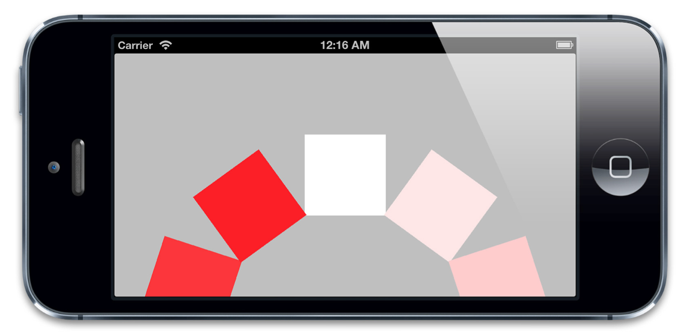
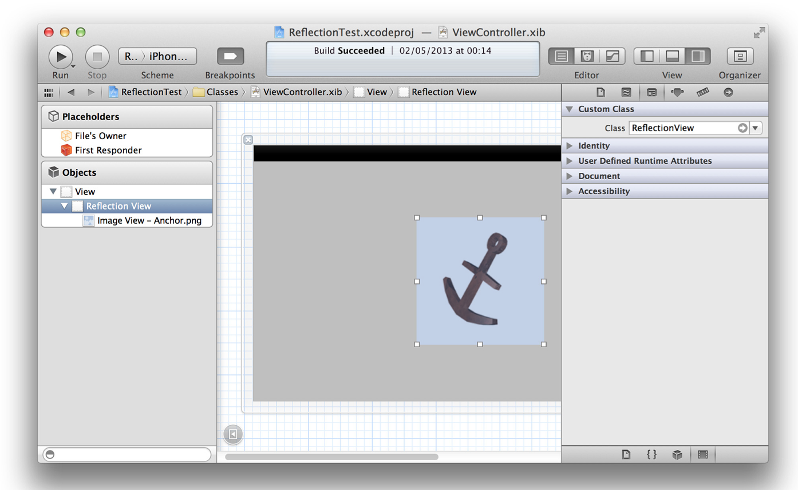
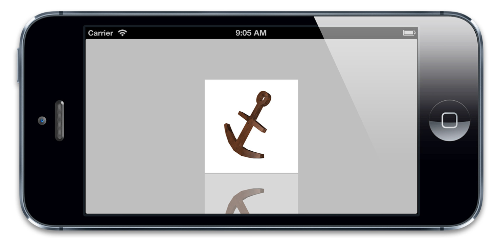

# CAReplicatorLayer


`CAReplicatorLayer`的目的是为了高效生成许多相似的图层。它会绘制一个或多个图层的子图层，并在每个复制体上应用不同的变换。看上去演示能够更加解释这些，我们来写个例子吧。

###重复图层（Repeating Layers）

清单6.8中，我们在屏幕的中间创建了一个小白色方块图层，然后用`CAReplicatorLayer`生成十个图层组成一个圆圈。`instanceCount`属性指定了图层需要重复多少次。`instanceTransform`指定了一个`CATransform3D`3D变换（这种情况下，下一图层的位移和旋转将会移动到圆圈的下一个点）。

变换是逐步增加的，每个实例都是相对于前一实例布局。这就是为什么这些复制体最终不会出现在同意位置上，图6.8是代码运行结果。

清单6.8 用`CAReplicatorLayer`重复图层

```objective-c
@interface ViewController ()

@property (nonatomic, weak) IBOutlet UIView *containerView;

@end

@implementation ViewController
- (void)viewDidLoad
{
    [super viewDidLoad];
    //create a replicator layer and add it to our view
    CAReplicatorLayer *replicator = [CAReplicatorLayer layer];
    replicator.frame = self.containerView.bounds;
    [self.containerView.layer addSublayer:replicator];

    //configure the replicator
    replicator.instanceCount = 10;

    //apply a transform for each instance
    CATransform3D transform = CATransform3DIdentity;
    transform = CATransform3DTranslate(transform, 0, 200, 0);
    transform = CATransform3DRotate(transform, M_PI / 5.0, 0, 0, 1);
    transform = CATransform3DTranslate(transform, 0, -200, 0);
    replicator.instanceTransform = transform;

    //apply a color shift for each instance
    replicator.instanceBlueOffset = -0.1;
    replicator.instanceGreenOffset = -0.1;

    //create a sublayer and place it inside the replicator
    CALayer *layer = [CALayer layer];
    layer.frame = CGRectMake(100.0f, 100.0f, 100.0f, 100.0f);
    layer.backgroundColor = [UIColor whiteColor].CGColor;
    [replicator addSublayer:layer];
}
@end
```



图6.8 用`CAReplicatorLayer`创建一圈图层

注意到当图层在重复的时候，他们的颜色也在变化：这是用`instanceBlueOffset`和`instanceGreenOffset`属性实现的。通过逐步减少蓝色和绿色通道，我们逐渐将图层颜色转换成了红色。这个复制效果看起来很酷，但是`CAReplicatorLayer`真正应用到实际程序上的场景比如：一个游戏中导弹的轨迹云，或者粒子爆炸（尽管iOS 5已经引入了`CAEmitterLayer`，它更适合创建任意的粒子效果）。除此之外，还有一个实际应用是：反射。

###反射

使用`CAReplicatorLayer`并应用一个负比例变换于一个复制图层，你就可以创建指定视图（或整个视图层次）内容的镜像图片，这样就创建了一个实时的『反射』效果。让我们来尝试实现这个创意：指定一个继承于`UIView`的`ReflectionView`，它会自动产生内容的反射效果。实现这个效果的代码很简单（见清单6.9），实际上用`ReflectionView`实现这个效果会更简单，我们只需要把`ReflectionView`的实例放置于Interface Builder（见图6.9），它就会实时生成子视图的反射，而不需要别的代码（见图6.10）.

清单6.9 用`CAReplicatorLayer`自动绘制反射

```objective-c
#import "ReflectionView.h"
#import <QuartzCore/QuartzCore.h>

@implementation ReflectionView

+ (Class)layerClass
{
    return [CAReplicatorLayer class];
}

- (void)setUp
{
    //configure replicator
    CAReplicatorLayer *layer = (CAReplicatorLayer *)self.layer;
    layer.instanceCount = 2;

    //move reflection instance below original and flip vertically
    CATransform3D transform = CATransform3DIdentity;
    CGFloat verticalOffset = self.bounds.size.height + 2;
    transform = CATransform3DTranslate(transform, 0, verticalOffset, 0);
    transform = CATransform3DScale(transform, 1, -1, 0);
    layer.instanceTransform = transform;

    //reduce alpha of reflection layer
    layer.instanceAlphaOffset = -0.6;
}

- (id)initWithFrame:(CGRect)frame
{
    //this is called when view is created in code
    if ((self = [super initWithFrame:frame])) {
        [self setUp];
    }
    return self;
}

- (void)awakeFromNib
{
    //this is called when view is created from a nib
    [self setUp];
}
@end
```



图6.9 在Interface Builder中使用`ReflectionView`



图6.10 `ReflectionView`自动实时产生反射效果。

开源代码`ReflectionView`完成了一个自适应的渐变淡出效果（用`CAGradientLayer`和图层蒙板实现），代码见 https://github.com/nicklockwood/ReflectionView
